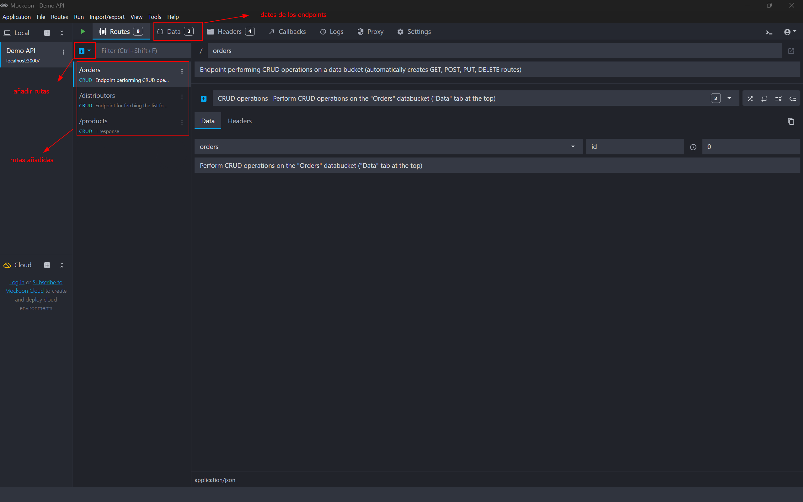
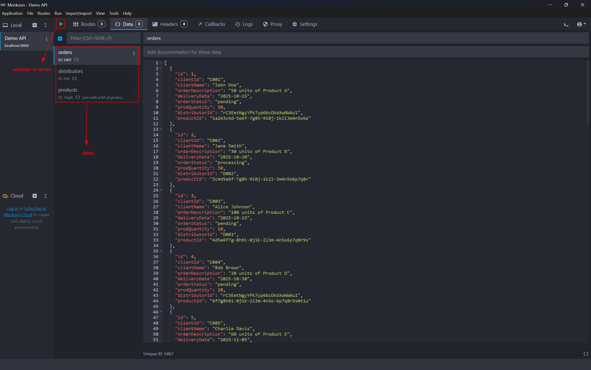
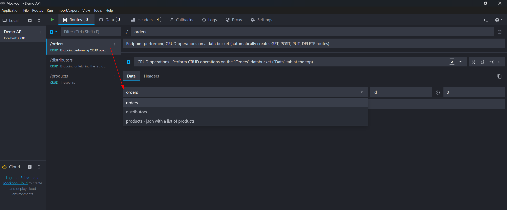
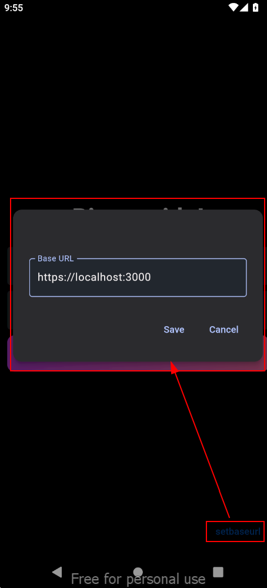
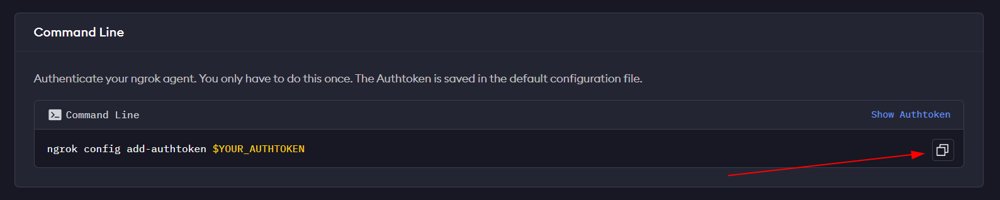
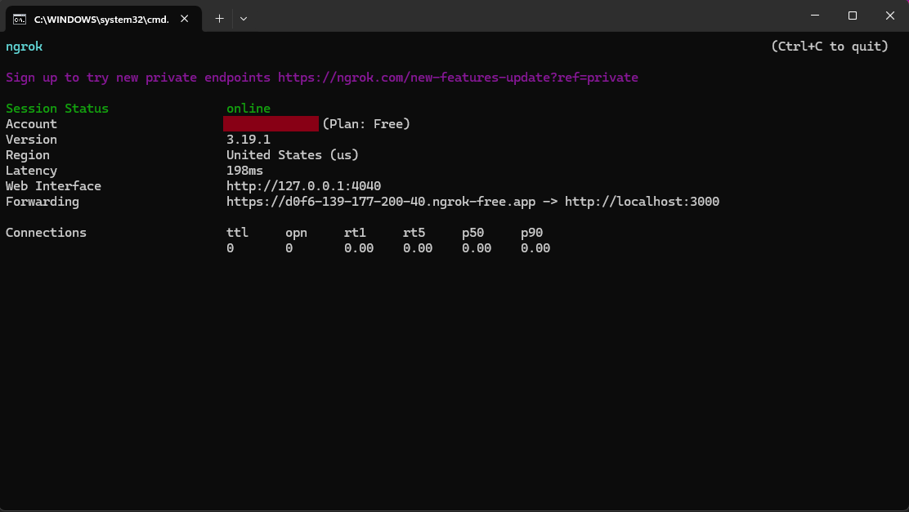

# order_track

Proyecto en Flutter usando BloC como gestor de estados para la gestión de órdenes por roles de usuario.

## Descripción

Esta aplicación está diseñada para gestionar órdenes de compra y distribución, permitiendo a los usuarios interactuar según sus roles específicos (Asignador, Distribuidor, Cliente). Cada rol tiene acceso a diferentes funcionalidades y vistas dentro de la aplicación, facilitando la gestión y seguimiento de órdenes de manera eficiente.

## Herramientas necesarias

Para poder correr la aplicación necesitaremos:
- [Mockoon](https://mockoon.com/download/): para la hacer mock del backend de la app. Con Mockoon podremos mantener un estado por sesión de las modificaciones que hagamos en los datos definidos inicialmente.
- [Ngrok](https://ngrok.com/downloads/windows) (opcional): para hacer el backend (Mockoon) accesible a través de internet.

## Configuraciones:

### Mockoon

Primero, descargar la app de escritorio para el Sistema Operativo que esté usando.

Seguidamente, debemos añadir 3 rutas (endpoints) de tipo *CRUD* con la *Data* que nos devolverá a la app cuando hagamos un request http: 

- **`/orders`**: contiene las todas las órdenes con las que estaremos trabajando
- **`/distributors`**: lista de distribuidores
- **`/products`**: lista de productos



Los datos los ingresaremos en la pestaña *Data* (en la carpeta `config` está un json para cada ruta con el contenido listo para copiar y pegar).



Una vez creada la data para cada endpoint, entonces vamos a asociar las rutas con cada juego de datos correspondiente



Cuando tengamos listos los endpoints con sus datos, podemos *correr* el server tocando el bottón *Play* que vimos en la screenshot anterior.

### Localmente accesible

Después de haber empezado Mockoon, para que la app tenga acceso a nuestro backend localmente, solo debemos cumplir dos condiciones:

1. Asegurarnos de que el teléfono y el server estén en la misma red (ej.: los dos conectados al mismo router como punto de acceso).

2. En la pantalla de login de la app, en la esquina inferior derecha está el botón `setbaseurl`, el cual presionaremos y entraremos `http://localhost:3000` en caso de que sea la url provista por Mockoon.



### Ngrok

Seguir los 3 primeros pasos descritos en [Ngrok - Getting started](https://ngrok.com/docs/getting-started/?os=windows).

Alternativamente, seguir los siguientes:

1. Descargar el agente de ngrok desde [Download](https://download.ngrok.com/).

2. Registrarse en la página de ngrok.

3. Ir al link [Dashboard](https://dashboard.ngrok.com/get-started/your-authtoken) para obtener el token a registrar en la aplicación.



4. Seguidamente, abriremos una terminal en la misma carpeta donde esté el recién descargado *ngrook.exe*.

5. Ejecutar `ngrok config add-authtoken <TOKEN>` sustituyendo "**\<TOKEN\>**" por el token obtenido.



6. En la terminal insertamos el comando `ngrok http 3000` y presionamos ENTER.

Si no tenemos el puerto 3000 ocupado, debe empezar normalmente. En caso contrario, debemos cambiar el puerto a otro número y probar nuevamente.

> En la carpeta `config` está el script *run_ngrook.bat*, el cual podremos descargar para empezar el server online después de haber completado los 5 primeros pasos.

En la aplicación podremos poner el link generado presionando el botón `setbaseurl` ubicado en la esquina inferior derecha.

> EL link generado no es estático, por lo que cada vez que ngrok se cierre, nuestro backend simulado no va a ser accesible por la app, y una vez abierto nuevamente, el link será diferente.

## OrderTrack

### Usuarios

Para hacer login en la app, se debe entrar con uno de los 3 usuarios definidos en Firebase Auth:

| Rol           | Email                       | Password                    |
|:-------------:|:---------------------------:|:---------------------------:|
| Cliente       | ```client@gmail.com```      | ```client@gmail.com```      |
| Repartidor    | ```distributor@gmail.com``` | ```distributor@gmail.com``` |
| Distribuidor  | ```allocator@gmail.com```   | ```allocator@gmail.com```   |
